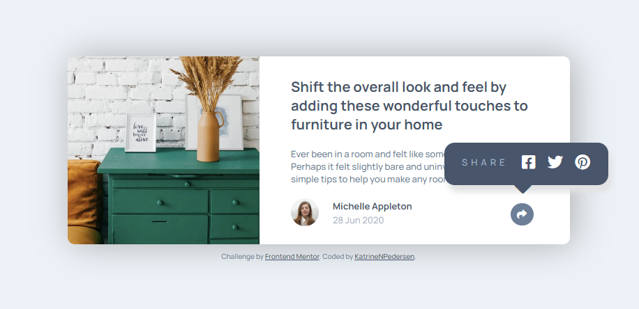

# Frontend Mentor - Article preview component solution

This is a solution to the [Article preview component challenge on Frontend Mentor](https://www.frontendmentor.io/challenges/article-preview-component-dYBN_pYFT). Frontend Mentor challenges help you improve your coding skills by building realistic projects.

## Table of contents

- [Overview](#overview)
  - [The challenge](#the-challenge)
  - [Screenshot](#screenshot)
  - [Links](#links)
- [My process](#my-process)
  - [Built with](#built-with)
  - [What I learned](#what-i-learned)
  - [Continued development](#continued-development)
  - [Useful resources](#useful-resources)
- [Author](#author)

## Overview

### The challenge

Users should be able to:

- View the optimal layout for the component depending on their device's screen size
- See the social media share links when they click the share icon

### Screenshot

### Links

- Solution URL: [https://github.com/KatrineNPedersen/Article-Preview-Component-Master.git]
- Live Site URL: [https://katrinenpedersen.github.io/Article-Preview-Component-Master]

## My process

### Built with

- Semantic HTML5 markup
- CSS custom properties
- Flexbox
- Mobile-first workflow

### What I learned

In this challenge I learned how to create JavaScript functions based on screen size and add an automatic page reload whenever the page gets resized. I also learned that object-fit: cover along with object-position allows you to only show a cropped version of an image based on your specifications.

### Continued development

This was my first challenge where I used CSS custom properties and it definitely made the css portion easier. I will be continuing to use the custom properties in the future.

### Useful resources

- [object-fit](https://developer.mozilla.org/en-US/docs/Web/CSS/object-fit) - This had a great overview of all the different object-fit options for when you are working with images

## Author

- Frontend Mentor - [@KatrineNPedersen](https://www.frontendmentor.io/profile/KatrineNPedersen)
